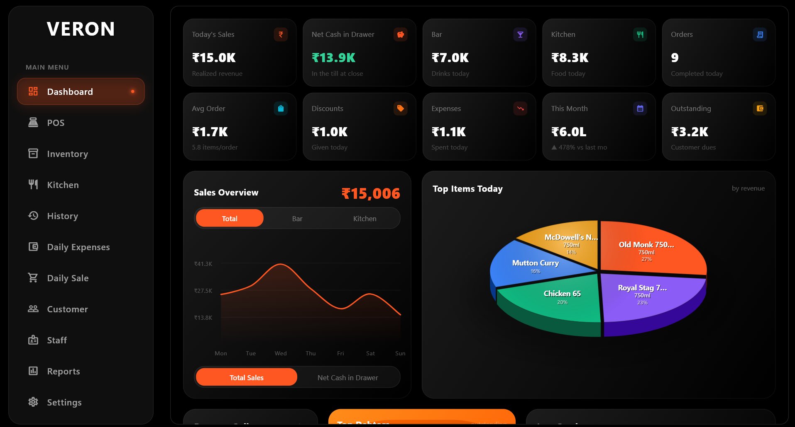

  

# Veron

Veron is point-of-sale and billing software for bars, liquor shops and restaurants.
It runs in production in a bar in Pune.

This repository holds Veron's marketing website: **[aditya-bhoye.github.io/Veron](https://aditya-bhoye.github.io/Veron/)**

## What Veron does

- **Billing** at the counter, on a desktop till.
- **Inventory**, with stock that updates as bills are made.
- **Staff roles**, so each person sees only what they need.
- **Customer credit (udhaar)**, tracked per customer.
- **A phone app** for the owner, with the same data in sync.

## The website

| File | Page |
|---|---|
| `index.html` | Home page: hero video, features and pricing plans |
| `pay.html` | Payment page |
| `privacy.html` | Privacy policy |
| `terms.html` | Terms of service |

The site is plain HTML, CSS and JavaScript, hosted on GitHub Pages.

## The app

The Veron app's source code is private.
It is built with Flutter and Dart, on Supabase and PostgreSQL.
